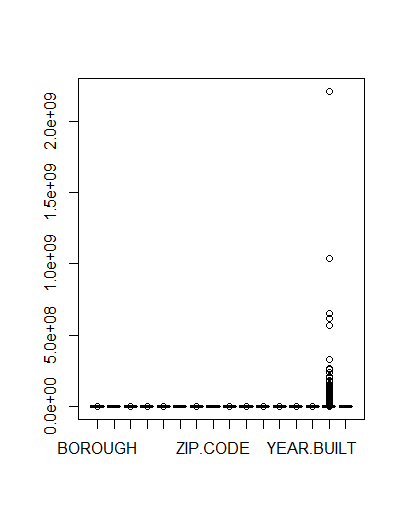

```{r setup, include=FALSE}
knitr::opts_chunk$set(echo = TRUE)
```

## R Markdown

**Summary:**

This is a house price prediction using the NYC data found in Kaggle. There was one consideration and important deision during the preparation. The size of the input file and all of the levels involved were complex. In order to make sure there was no memroy allocation issue, the train set and validation set were further reduced to a subset, using only a few columns. 

The final result was checked using RMSE against Lasso Regression Model.


**Analysis:**

I uded the NYC Property Sales data from Kaggle. Upon initial inspection of the csv file, I decided there were some columns not interesting to me. First step was to remove those columns. Next I removed any row with blank, 0 or dash for Sales Prices. I also removed rows that had 0 for zip code and 0 for Year Built. I discovered there are some properties with no gross square footage. Therefore, I removed them from my data set. 

I converted two columns to numeric, namley Borough and Sales Price. In this data set, Borough is given as a number instead the commonly known name such as Bronx. I followed this with a duplicate row removal. 

Now was the time to visualize the data. All the visuals discussed in this section are given in Results section. I am calling the clean data cleandata. First visual is a box plot of cleandata. The second visual is a histogram of cleandata for Year Built. I could immediately see that nearly all sales were for houses built after 1900. I validate this a second time by ggplot, Sales Price vs Year Built. This ggplot was an easier plot to understand where the heavy concentration lies. 

Based on what I saw from the previous plot, I decided to remove the outliers and plot another visual, only houses built after 1800 and price lower than $300 Million were included. 

I removed houses built prior to 1800 in cleandata and also excluded houses sold below $100K or above $300 Million. I then plotted Price vs Year Built again. As expected the last two plots are similar. 

Next I ploted Residential Units vs Building Category, Commercial Units vs Building Category and property allocation by Borough. 

Now was time to create the training set and validation set. I used 10% of cleandata to create the validation set and used the other 90% for training. As I was running into memory shortage, I decide to use only BOROUGH, NEIGHBORHOOD,SALE.PRICE and YEAR.BUILT as my columns. Therefore, I created a subset of the train data and a subset of the validation data using this criteria. 

Modeling approach is Lasso Regression. I created the model, trained the data and predicted house prices using this Lasso Regression. 

Final visualization was to plot the resulting prediction vs Year Built. I saw a similar concentration area which made me confident of the result.


**Results**

The plots below are sequenced as per the analysis section. 



 


 


 


$\pagebreak$

**Conclusion:**

When looking at the final plot, I observed that the concentration of sales price in relation to year built remained the same. This gave me confidence the model used was adequate and no further modeling was necessary for the computing power I am using. The RMSE gave 0.2868. This was an additional confirmation the model was good enough. 

Lasso Regression was the method used for this project and one I will consider for future house price prediction in any city with similar data.


